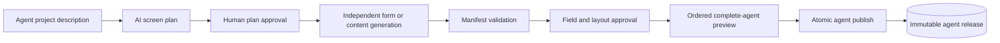

# Agent Screen Studio

Agent Screen Studio turns a plain-language description of an AI agent into a
validated, reusable, multi-screen experience.

The application first uses an LLM to propose an ordered screen plan. After
human approval, each form or content screen is generated, reviewed, validated,
and saved independently.

> [!IMPORTANT]
> Multi-screen projects create safe form and informational content screens.
> They do not permit raw HTML, scripts, custom CSS, credentials, or arbitrary
> remote resources.

## What it supports

- LLM-generated input schemas through LiteLLM.
- AI-proposed agent screen plans with human editing before generation.
- Agent projects containing up to 20 independently editable form or content screens.
- Single-screen forms and multi-step wizards.
- Human approval for every AI-suggested input.
- LLM-proposed headings, paragraphs, sections, dividers, callouts, and field
  placement in the same generation request.
- A safe content-and-layout editor with whole-layout approval, accessible
  move controls, and no raw HTML, JavaScript, CSS, or JSON editing.
- Editing, excluding, and removing suggested fields.
- Human-authored fields with configurable type and required state.
- Placement of custom fields into a selected wizard step.
- Backend validation before preview and before storage.
- One mutable working draft per project screen plus immutable, atomic agent releases.
- Searchable Agent Library with project duplication, release history,
  restore-to-drafts, and reversible project or screen archiving.
- Loading previously saved screens without calling the LLM again.
- Responsive desktop, tablet, and mobile interface.
- Route-separated builder, preview, published screen, and saved library.
- Creation-tool editor with project navigation, a live device canvas, field
  cards, draft/published status, and a properties inspector.
- Versioned agent presentation settings: display name, icon, accent color,
  welcome copy, submit label, and optional wizard answer summary.
- File-upload fields rendered as focused drop areas when a field uses the
  `data-url` format.

## How it works



The manifest is the contract shared by the LLM, backend, and frontend. It
contains:

- `input_schema`: a JSON Schema describing only the information to collect.
- `ui_hints.mode`: either `single` or `wizard`.
- `ui_hints.field_order`: the complete display order.
- `ui_hints.groups`: wizard-step definitions when wizard mode is selected.
- `ui_hints.blocks`: safe content and field placement for a single screen.
- `ui_hints.groups[].blocks`: safe content and field placement for each
  wizard step.

Content is stored as allowlisted JSON blocks and mapped to controlled React
components. Input values remain owned by React JSON Schema Form, so adding
content does not bypass schema validation or change submitted data.

See [the manifest contract](backend/MANIFEST_CONTRACT.md) for examples and
validation invariants.

Visual settings are stored in the working draft and copied into each immutable
published version. They cannot change or bypass the validated input contract.

## Technology

| Area | Technology |
| --- | --- |
| Frontend | React 18, Vite, React JSON Schema Form, Bootstrap 4 |
| Backend | FastAPI, Pydantic, JSON Schema |
| LLM gateway | LiteLLM |
| Supported configuration | Google Vertex AI or Gemini API key |
| Storage | MongoDB with mutable drafts and immutable published versions |
| Testing | Vitest, Testing Library, pytest |

## Project structure

```text
ScreenConfigurator/
├── backend/
│   ├── main.py                  # FastAPI routes and validation gates
│   ├── llm.py                   # LiteLLM request and system prompt
│   ├── validation.py            # Structural and semantic validation
│   ├── meta_schema.py           # Manifest meta-schema
│   ├── manifest_migrations.py   # Compatibility for older saved manifests
│   ├── db.py                    # MongoDB draft and published-version registry
│   ├── project_db.py            # Agent projects, ordered screens, and releases
│   ├── content_manifest.py      # Safe content-screen validation
│   ├── MANIFEST_CONTRACT.md
│   └── test_*.py
├── frontend/
│   ├── src/
│   │   ├── App.jsx              # Route map and lazy route boundaries
│   │   ├── AgentLibraryPage.jsx # Multi-screen agent project library
│   │   ├── AgentWorkspacePage.jsx # Screens, order, settings, and releases
│   │   ├── AgentPreviewPage.jsx # Complete mutable-project preview
│   │   ├── PublishedAgentPage.jsx # Immutable published agent experience
│   │   ├── AgentFlow.jsx        # Ordered form/content screen navigation
│   │   ├── BuilderPage.jsx      # New/edit configuration routes
│   │   ├── ContentBuilderPage.jsx # Safe content-only screen editor
│   │   ├── ContentExperience.jsx # Safe content-only screen renderer
│   │   ├── PreviewPage.jsx      # Isolated draft and saved previews
│   │   ├── PublishedScreenPage.jsx # Clean user-facing input route
│   │   ├── ScreenExperience.jsx # Shared single/wizard rendering surface
│   │   ├── StudioShell.jsx      # Shared Studio navigation and route states
│   │   ├── routeDraft.js        # Session-backed handoff to draft preview
│   │   ├── presentation.js      # Agent branding defaults and normalization
│   │   ├── ManifestReview.jsx   # Human approval workflow
│   │   ├── AddFieldForm.jsx     # Human-authored input builder
│   │   ├── FormRenderer.jsx     # Generic JSON Schema renderer
│   │   ├── LayoutRenderer.jsx   # Safe block-to-React rendering
│   │   ├── LayoutEditor.jsx     # Human layout review and editing
│   │   ├── layoutBlocks.js      # Immutable layout operations and migration
│   │   ├── Wizard.jsx           # Multi-step renderer
│   │   ├── reviewModel.js       # Immutable review operations
│   │   └── styles.css           # Responsive design system
│   └── package.json
└── README.md
```

## Prerequisites

- Python 3.10 or newer.
- Node.js `20.19+` or `22.12+`.
- MongoDB running locally or an accessible MongoDB Atlas deployment.
- One LLM authentication method:
  - Google Cloud Application Default Credentials for Vertex AI, or
  - a valid Gemini API key.

## Local setup

### 1. Clone the repository

```bash
git clone https://github.com/nerve-sparks/ScreenConfigurator.git
cd ScreenConfigurator
```

### 2. Configure and run MongoDB

The backend creates and uses:

- Database: `agent_screens`
- Collection: `agent_projects` for agent identity and ordered navigation
- Collection: `manifests` for mutable screen drafts and legacy published versions
- Collection: `agent_releases` for complete immutable multi-screen releases
- Collection: `screen_metadata` for reversible archive state

For a local MongoDB server, the default connection is:

```dotenv
MONGODB_URI=mongodb://localhost:27017
```

The backend intentionally fails during startup when MongoDB is unavailable, so
start MongoDB before starting FastAPI.

### 3. Configure the backend

```bash
cd backend
python -m venv .venv
```

Activate the virtual environment:

```powershell
# Windows PowerShell
.\.venv\Scripts\Activate.ps1
```

```bash
# macOS or Linux
source .venv/bin/activate
```

Install the dependencies and create the local environment file:

```bash
python -m pip install -r requirements.txt
```

```powershell
# Windows PowerShell
Copy-Item .env.example .env
```

```bash
# macOS or Linux
cp .env.example .env
```

Choose one of the following LiteLLM configurations in `backend/.env`. When
`LITE_LLM_ENABLE=true`, the organization gateway takes precedence and `MODEL`
is ignored. When the flag is absent or false, the existing direct provider
configuration is used.

#### Option A: Organization LiteLLM gateway

Use this configuration for an OpenAI-compatible LiteLLM proxy:

```dotenv
LITE_LLM_ENABLE=true
LITE_LLM_BASE_URL=https://your-litellm-gateway.example.com
LITE_LLM_KEY=your-gateway-key
LITE_LLM_PROVIDER=gemini
LITE_LLM_MODEL_GEMINI=gemini/gemini-3.5-flash
LITE_LLM_MODEL_OPENAI=gpt-5.5
MONGODB_URI=mongodb://localhost:27017
```

`LITE_LLM_PROVIDER` is the application-wide selector. Use `gemini` to read
`LITE_LLM_MODEL_GEMINI`, or `openai` to read `LITE_LLM_MODEL_OPENAI`. When the
selector is omitted, the backend defaults to `gemini` for compatibility with
older environment files. Restart FastAPI after changing it because the shared
LiteLLM router is cached for the lifetime of the backend process. There is no
automatic fallback: every generation uses the explicitly selected provider.

The application creates one shared LiteLLM `Router` and sends the gateway a
completion request with an 8,000-token output limit and a configurable provider
deadline (`LLM_GENERATION_TIMEOUT_SECONDS`, 45 seconds by default). The
configured model name may be bare or start with `openai/`; the application adds
that provider prefix when needed because the gateway uses the OpenAI-compatible
wire format.

Gemini and GPT-5.5 use JSON-object response mode because their structured-output
implementations do not accept every rule in the application's complete
draft-2020-12 manifest meta-schema. Compatible other models use the complete
response schema when LiteLLM reports support; unsupported models fall back to
JSON-object mode. The full field, wizard, content-block, and security contract
is always enforced immediately by the backend.
Responses are parsed as strict JSON first, with repair for common truncation
and syntax problems. Invalid JSON or a manifest that fails backend validation
receives exactly one correction attempt containing the validation errors.
Provider errors are mapped to generic API messages so credentials or provider
internals never reach the browser.

Optional generation-level Langfuse tracing activates when both keys are set:

```dotenv
LANGFUSE_PUBLIC_KEY=pk-lf-...
LANGFUSE_SECRET_KEY=sk-lf-...
LANGFUSE_BASE_URL=https://cloud.langfuse.com
```

Langfuse records the selected model, user prompt, generated output, token usage,
and latency. Leave the keys unset to disable tracing locally.

#### Option B: Direct Vertex AI through LiteLLM

```dotenv
MODEL=vertex_ai/gemini-3.5-flash
VERTEXAI_PROJECT=your-google-cloud-project-id
VERTEXAI_LOCATION=global
MONGODB_URI=mongodb://localhost:27017
```

Authenticate locally with Application Default Credentials:

```bash
gcloud auth application-default login
```

#### Option C: Direct Gemini through LiteLLM

```dotenv
MODEL=gemini/gemini-3.5-flash
GEMINI_API_KEY=your-valid-gemini-api-key
MONGODB_URI=mongodb://localhost:27017
```

Do not configure a placeholder key. The Google API will return
`API_KEY_INVALID` when the value is missing, expired, restricted incorrectly,
or copied incorrectly.

Other direct LiteLLM providers can be used by setting an appropriate `MODEL`
and the credentials expected by LiteLLM, but they do not currently receive the
same application-level configuration checks as Gemini and Vertex AI.

Start the backend from the `backend` directory:

```bash
uvicorn main:app --reload --port 8000
```

FastAPI documentation is available at <http://localhost:8000/docs>.

### 4. Configure and run the frontend

Open a second terminal:

```bash
cd frontend
npm ci
npm run dev
```

Open <http://localhost:5173>.

The frontend calls `http://localhost:8000` by default. If the backend is using
a different port, create `frontend/.env.local`:

```dotenv
VITE_API_URL=http://localhost:8001
```

Restart Vite after changing an environment variable.

### Frontend routes

| Route | Purpose |
| --- | --- |
| `/builder/new` | Generate and review a new input configuration. |
| `/builder/{screenId}/edit` | Load a saved configuration into the editor. |
| `/preview/draft` | Test the current validated working draft. |
| `/preview/{screenId}` | Test a saved screen without builder controls. |
| `/screens/{screenId}` | Open the clean published input experience. |
| `/library` | Search, filter, duplicate, archive, and open agent projects. |
| `/studio/agents/new` | Create an Agent Project and start its AI screen plan. |
| `/studio/agents/{agentId}` | Manage screens, ordering, settings, and releases. |
| `/studio/agents/{agentId}/screens/{screenId}/edit` | Edit a form screen. |
| `/studio/agents/{agentId}/screens/{screenId}/content` | Edit a safe content screen. |
| `/studio/agents/{agentId}/preview` | Test the complete ordered draft experience. |
| `/agents/{agentId}` | Open the latest immutable published agent release. |

The legacy root URL redirects to `/builder/new`. The preview handoff is also
kept in browser session storage so refreshing `/preview/draft` does not discard
the current test screen. Actual values typed while testing the preview remain
in browser memory and are never sent to draft or publish storage.

Production hosting must send unknown frontend paths to `index.html` so direct
links such as `/screens/email-agent` can be handled by React Router.

## Using the application

1. Create an agent project with a stable name and description.
2. Generate an AI screen plan, then edit, add, or remove proposals.
3. Approve the plan to generate each form or content screen independently.
4. Review form fields and safe content/layout blocks; failed generations can be retried.
5. Create additional screens manually or duplicate an existing project screen.
6. Set accessible screen ordering and select the start screen.
7. Test the complete ordered journey. Form screens validate before advancing;
   content screens advance directly, and Back preserves values in browser memory.
8. Publish after every active screen is approved. One immutable release snapshots
   project settings, navigation, and all included screen manifests atomically.
9. Open `/agents/{agentId}` or restore an older release into new mutable drafts.

Human-authored fields are approved when they are created because their creation
is already an explicit human decision. At least one field must remain approved
before the screen can reach preview.

## API

| Method | Endpoint | Purpose |
| --- | --- | --- |
| `POST` | `/generate` | Generate and validate a manifest from an agent description. |
| `POST` | `/validate` | Validate the human-reviewed manifest before preview. |
| `POST` | `/agents` | Create a uniquely named agent project. |
| `GET` | `/agents` | List Agent Library projects and lifecycle counts. |
| `GET` | `/agents/{agent_id}` | Load project metadata and screen summaries. |
| `PUT` | `/agents/{agent_id}/draft` | Save identity, order, and start-screen settings. |
| `POST` | `/agents/{agent_id}/screen-plan/generate` | Generate a validated screen proposal. |
| `POST` | `/agents/{agent_id}/screens/generate` | Generate one form or content screen manifest. |
| `POST/PUT/GET` | `/agents/{agent_id}/screens/{screen_id}/draft` | Create, save, or load an independent screen draft. |
| `POST` | `/agents/{agent_id}/screens/{screen_id}/duplicate` | Duplicate a project screen under a new stable ID. |
| `PATCH` | `/agents/{agent_id}/screens/{screen_id}/archive` | Archive or restore a project screen. |
| `POST` | `/agents/{agent_id}/publish` | Atomically create an immutable agent release. |
| `GET` | `/agents/{agent_id}/releases` | List immutable release history. |
| `GET` | `/agents/{agent_id}/releases/{version}` | Load one immutable release. |
| `POST` | `/agents/{agent_id}/releases/{version}/restore` | Copy a release back into mutable drafts. |
| `GET` | `/agents/{agent_id}/published` | Load the latest or selected published release. |
| `POST` | `/screens/{agent_id}/draft` | Create the first draft, rejecting mismatched or existing IDs. |
| `PUT` | `/screens/{agent_id}/draft` | Update an existing mutable working draft. |
| `GET` | `/screens/{agent_id}/draft` | Load the working draft and human-review state. |
| `POST` | `/screens/{agent_id}/publish` | Validate and publish the current draft revision. |
| `POST` | `/screens` | Legacy direct-publish endpoint for older clients. |
| `GET` | `/screens` | List draft-only and published screens. |
| `GET` | `/screens/{agent_id}/versions` | List immutable published-version history. |
| `POST` | `/screens/{agent_id}/duplicate` | Copy the latest working state into a new draft. |
| `POST` | `/screens/{agent_id}/versions/{version}/restore` | Copy an older version over the working draft. |
| `PATCH` | `/screens/{agent_id}/archive` | Archive or unarchive a screen without deleting it. |
| `GET` | `/screens/{agent_id}` | Load the latest saved version. |
| `GET` | `/screens/{agent_id}?version=2` | Load a specific saved version. |

Example generation request:

```bash
curl -X POST http://localhost:8000/generate \
  -H "Content-Type: application/json" \
  -d '{"description":"An agent that drafts and schedules customer emails"}'
```

## Validation and storage guarantees

Every manifest passes two validation layers:

1. Safety validation rejects references, HTML/scripts, custom widgets, and
   application-owned identity or permission metadata.
2. Structural validation against `backend/meta_schema.py` enforces the audited
   field subset and the 30-field maximum.
3. Semantic validation in `backend/validation.py` checks field constraints,
   references, ordering, required fields, and wizard-group ownership.

The strict gate applies during generation, preview, and publishing. An
in-progress editor draft may be autosaved with validation errors so work is not
lost, but it cannot reach preview or become a published version until it passes
human review and backend validation.

MongoDB uses project, screen-draft, and release states:

- Repeated autosaves update one mutable screen draft per `(agent_id, screen_id)`.
- Project revisions protect ordered navigation and identity edits from stale saves.
- Publishing inserts one complete release document containing every approved
  screen snapshot, its order, start screen, presentation, and source revisions.
- Existing releases are never updated in place and remain loadable.
- Restoring a release copies navigation and screens into mutable drafts without
  changing immutable history.
- Compound indexes prevent duplicate screen versions and drafts.
- Legacy `/screens` documents and URLs remain supported and are exposed as
  one-screen projects without renaming their IDs.
- Preview submissions, agent output/history, credentials, and LLM reasoning are
  not part of either storage document.

## Testing

### Backend

```bash
cd backend
python -m pip install -r requirements-dev.txt
python -m pytest -q
```

All normal LLM tests mock LiteLLM, so CI makes no paid or flaky provider calls.
To run the optional real Vertex AI smoke test locally after configuring
Application Default Credentials:

```powershell
$env:RUN_VERTEX_AI_SMOKE_TEST="true"
$env:VERTEX_SMOKE_MODEL="vertex_ai/gemini-3.5-flash"
python -m pytest -q test_llm.py -k optional_real_vertex_ai_smoke
```

### Frontend

```bash
cd frontend
npm ci
npm test
npm run build
npm audit --audit-level=high
```

The production build uses workflow-based code splitting: the review screen,
custom-field builder, wizard, and JSON Schema renderer are loaded only when
their workflow stage needs them.

## Troubleshooting

### `API key not valid` or `API_KEY_INVALID`

- Confirm that `MODEL` begins with `gemini/` when using `GEMINI_API_KEY`.
- Replace placeholder values with an active key.
- Check for accidental spaces or quotes around the key.
- Restart FastAPI after editing `backend/.env`.
- If using Vertex AI, remove the Gemini key requirement by using a
  `vertex_ai/...` model and authenticate with Application Default Credentials.

### LiteLLM gateway configuration error

- Set `LITE_LLM_ENABLE=true` only when all three gateway settings are present:
  `LITE_LLM_BASE_URL`, `LITE_LLM_KEY`, `LITE_LLM_PROVIDER`, and the model
  setting selected by that provider.
- Use `LITE_LLM_PROVIDER=gemini` with `LITE_LLM_MODEL_GEMINI`, or
  `LITE_LLM_PROVIDER=openai` with `LITE_LLM_MODEL_OPENAI`.
- If `LITE_LLM_PROVIDER` is omitted, Gemini remains the default.
- Use only a model that the gateway key is permitted to access. For the current
  development key, the confirmed OpenAI model is `gpt-5.5`, not `gpt-5.1`.
- Use the gateway's base URL, not a model-specific endpoint URL.
- Do not add quotes or trailing spaces around values in `backend/.env`.
- Set `LITE_LLM_ENABLE=false` to return to the direct `MODEL` configuration.
- Restart FastAPI after changing `backend/.env`; the shared router is created
  once per backend process.

### Backend cannot reach MongoDB

- Confirm that MongoDB is running.
- Check `MONGODB_URI` in `backend/.env`.
- For MongoDB Atlas, confirm network access and credentials.
- Restart FastAPI after correcting the URI.

### Frontend reports a network or fetch error

- Confirm FastAPI is running.
- Confirm `VITE_API_URL` matches the backend port.
- Use `localhost:5173` or `127.0.0.1:5173`; both are allowed by the backend's
  development CORS configuration.
- Restart Vite after editing `frontend/.env.local`.

### Generated screen request fails

The backend retries invalid LLM output once. A `502` after that means both
responses violated the manifest contract or the provider request failed; a
`504` means the configured generation timeout expired. Review backend logs for
the failure category without exposing credentials to the browser. Direct
`/validate` requests still return `422` with actionable manifest errors.

## Security notes

- Never commit `backend/.env`, `frontend/.env`, or `frontend/.env.local`.
- Never place API keys directly in source files.
- Prefer Application Default Credentials for local Vertex AI development.
- Rotate a key immediately if it is accidentally exposed.

## Current scope

Agent Screen Studio deliberately does not:

- run or host the generated agent;
- call the generated agent when a preview form is submitted;
- generate output/result pages;
- embed a separate backend for every agent.

It provides one shared backend for manifest generation, validation, versioning,
and retrieval, while keeping the generated UI generic and agent-independent.
