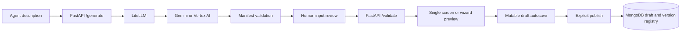

# Agent Screen Studio

Agent Screen Studio turns a plain-language description of an AI agent into a
validated, reusable input experience.

The application uses an LLM to determine what information an agent should ask
from its user. A human can then approve, edit, exclude, or add inputs before the
screen is rendered and saved.

> [!IMPORTANT]
> This project creates **input screens only**. It does not execute the agent,
> integrate an agent's business logic, or generate output/result screens.

## What it supports

- LLM-generated input schemas through LiteLLM.
- Single-screen forms and multi-step wizards.
- Human approval for every AI-suggested input.
- Editing, excluding, and removing suggested fields.
- Human-authored fields with configurable type and required state.
- Placement of custom fields into a selected wizard step.
- Backend validation before preview and before storage.
- One mutable working draft per screen plus immutable published versions in MongoDB.
- Loading previously saved screens without calling the LLM again.
- Responsive desktop, tablet, and mobile interface.
- Route-separated builder, preview, published screen, and saved library.
- Creation-tool editor with project navigation, a live device canvas, field
  cards, draft/published status, and a properties inspector.
- Versioned agent presentation settings: display name, icon, accent color,
  welcome copy, submit label, and optional wizard answer summary.
- File-upload fields rendered as focused drop areas when a field uses the
  `data-url` format.

## How it works



The manifest is the contract shared by the LLM, backend, and frontend. It
contains:

- `input_schema`: a JSON Schema describing only the information to collect.
- `ui_hints.mode`: either `single` or `wizard`.
- `ui_hints.field_order`: the complete display order.
- `ui_hints.groups`: wizard-step definitions when wizard mode is selected.

See [the manifest contract](backend/MANIFEST_CONTRACT.md) for examples and
validation invariants.

Visual settings are stored in the working draft and copied into each immutable
published version. They cannot change or bypass the validated input contract.

## Technology

| Area | Technology |
| --- | --- |
| Frontend | React 18, Vite, React JSON Schema Form, Bootstrap 4 |
| Backend | FastAPI, Pydantic, JSON Schema |
| LLM gateway | LiteLLM |
| Supported configuration | Google Vertex AI or Gemini API key |
| Storage | MongoDB with mutable drafts and immutable published versions |
| Testing | Vitest, Testing Library, pytest |

## Project structure

```text
ScreenConfigurator/
├── backend/
│   ├── main.py                  # FastAPI routes and validation gates
│   ├── llm.py                   # LiteLLM request and system prompt
│   ├── validation.py            # Structural and semantic validation
│   ├── meta_schema.py           # Manifest meta-schema
│   ├── manifest_migrations.py   # Compatibility for older saved manifests
│   ├── db.py                    # MongoDB draft and published-version registry
│   ├── MANIFEST_CONTRACT.md
│   └── test_*.py
├── frontend/
│   ├── src/
│   │   ├── App.jsx              # Route map and lazy route boundaries
│   │   ├── BuilderPage.jsx      # New/edit configuration routes
│   │   ├── PreviewPage.jsx      # Isolated draft and saved previews
│   │   ├── PublishedScreenPage.jsx # Clean user-facing input route
│   │   ├── LibraryPage.jsx      # Saved screen configuration picker
│   │   ├── ScreenExperience.jsx # Shared single/wizard rendering surface
│   │   ├── StudioShell.jsx      # Shared Studio navigation and route states
│   │   ├── routeDraft.js        # Session-backed handoff to draft preview
│   │   ├── presentation.js      # Agent branding defaults and normalization
│   │   ├── ManifestReview.jsx   # Human approval workflow
│   │   ├── AddFieldForm.jsx     # Human-authored input builder
│   │   ├── FormRenderer.jsx     # Generic JSON Schema renderer
│   │   ├── Wizard.jsx           # Multi-step renderer
│   │   ├── reviewModel.js       # Immutable review operations
│   │   └── styles.css           # Responsive design system
│   └── package.json
└── README.md
```

## Prerequisites

- Python 3.10 or newer.
- Node.js `20.19+` or `22.12+`.
- MongoDB running locally or an accessible MongoDB Atlas deployment.
- One LLM authentication method:
  - Google Cloud Application Default Credentials for Vertex AI, or
  - a valid Gemini API key.

## Local setup

### 1. Clone the repository

```bash
git clone https://github.com/nerve-sparks/ScreenConfigurator.git
cd ScreenConfigurator
```

### 2. Configure and run MongoDB

The backend creates and uses:

- Database: `agent_screens`
- Collection: `manifests`

For a local MongoDB server, the default connection is:

```dotenv
MONGODB_URI=mongodb://localhost:27017
```

The backend intentionally fails during startup when MongoDB is unavailable, so
start MongoDB before starting FastAPI.

### 3. Configure the backend

```bash
cd backend
python -m venv .venv
```

Activate the virtual environment:

```powershell
# Windows PowerShell
.\.venv\Scripts\Activate.ps1
```

```bash
# macOS or Linux
source .venv/bin/activate
```

Install the dependencies and create the local environment file:

```bash
python -m pip install -r requirements.txt
```

```powershell
# Windows PowerShell
Copy-Item .env.example .env
```

```bash
# macOS or Linux
cp .env.example .env
```

Choose one of the following LiteLLM configurations in `backend/.env`. When
`LITE_LLM_ENABLE=true`, the organization gateway takes precedence and `MODEL`
is ignored. When the flag is absent or false, the existing direct provider
configuration is used.

#### Option A: Organization LiteLLM gateway

Use this configuration for an OpenAI-compatible LiteLLM proxy:

```dotenv
LITE_LLM_ENABLE=true
LITE_LLM_BASE_URL=https://your-litellm-gateway.example.com
LITE_LLM_KEY=your-gateway-key
LITE_LLM_MODEL_GEMINI=your-gateway-model-name
MONGODB_URI=mongodb://localhost:27017
```

The application creates one shared LiteLLM `Router` and sends the gateway a
JSON-object completion request with an 8,000-token output limit. The configured
model name may be bare or start with `openai/`; the application adds that
provider prefix when needed because the gateway uses the OpenAI-compatible wire
format.

Gateway responses are parsed as strict JSON first. Common truncation and syntax
problems are repaired when possible, after which the normal structural and
semantic manifest validation gates still apply.

Optional generation-level Langfuse tracing activates when both keys are set:

```dotenv
LANGFUSE_PUBLIC_KEY=pk-lf-...
LANGFUSE_SECRET_KEY=sk-lf-...
LANGFUSE_BASE_URL=https://cloud.langfuse.com
```

Langfuse records the selected model, user prompt, generated output, token usage,
and latency. Leave the keys unset to disable tracing locally.

#### Option B: Direct Vertex AI through LiteLLM

```dotenv
MODEL=vertex_ai/gemini-3.5-flash
VERTEXAI_PROJECT=your-google-cloud-project-id
VERTEXAI_LOCATION=global
MONGODB_URI=mongodb://localhost:27017
```

Authenticate locally with Application Default Credentials:

```bash
gcloud auth application-default login
```

#### Option C: Direct Gemini through LiteLLM

```dotenv
MODEL=gemini/gemini-3.5-flash
GEMINI_API_KEY=your-valid-gemini-api-key
MONGODB_URI=mongodb://localhost:27017
```

Do not configure a placeholder key. The Google API will return
`API_KEY_INVALID` when the value is missing, expired, restricted incorrectly,
or copied incorrectly.

Other direct LiteLLM providers can be used by setting an appropriate `MODEL`
and the credentials expected by LiteLLM, but they do not currently receive the
same application-level configuration checks as Gemini and Vertex AI.

Start the backend from the `backend` directory:

```bash
uvicorn main:app --reload --port 8000
```

FastAPI documentation is available at <http://localhost:8000/docs>.

### 4. Configure and run the frontend

Open a second terminal:

```bash
cd frontend
npm ci
npm run dev
```

Open <http://localhost:5173>.

The frontend calls `http://localhost:8000` by default. If the backend is using
a different port, create `frontend/.env.local`:

```dotenv
VITE_API_URL=http://localhost:8001
```

Restart Vite after changing an environment variable.

### Frontend routes

| Route | Purpose |
| --- | --- |
| `/builder/new` | Generate and review a new input configuration. |
| `/builder/{screenId}/edit` | Load a saved configuration into the editor. |
| `/preview/draft` | Test the current validated working draft. |
| `/preview/{screenId}` | Test a saved screen without builder controls. |
| `/screens/{screenId}` | Open the clean published input experience. |
| `/library` | Browse saved configurations and choose edit, preview, or published routes. |

The legacy root URL redirects to `/builder/new`. The preview handoff is also
kept in browser session storage so refreshing `/preview/draft` does not discard
the current test screen. Actual values typed while testing the preview remain
in browser memory and are never sent to draft or publish storage.

Production hosting must send unknown frontend paths to `index.html` so direct
links such as `/screens/email-agent` can be handled by React Router.

## Using the application

1. Describe the agent's job and the information it needs.
2. Select **Generate inputs**.
3. Review every AI-suggested input.
4. Approve, edit, exclude, or remove fields.
5. Add any missing human-authored inputs.
6. Customize the agent identity and test desktop, tablet, or mobile sizes from
   the live canvas.
7. Select **Continue to preview** or **Validate & preview** after all fields are
   reviewed. The application moves to the isolated `/preview/draft` route.
8. Test the generated single-screen form or wizard without builder controls.
9. Confirm the generated screen ID, enter a short change summary, and select
   **Publish version**.
10. Open the clean `/screens/{screenId}` input UI or manage drafts and published
    versions from `/library`.

Human-authored fields are approved when they are created because their creation
is already an explicit human decision. At least one field must remain approved
before the screen can reach preview.

## API

| Method | Endpoint | Purpose |
| --- | --- | --- |
| `POST` | `/generate` | Generate and validate a manifest from an agent description. |
| `POST` | `/validate` | Validate the human-reviewed manifest before preview. |
| `PUT` | `/screens/{agent_id}/draft` | Create or update the single mutable working draft. |
| `GET` | `/screens/{agent_id}/draft` | Load the working draft and human-review state. |
| `POST` | `/screens/{agent_id}/publish` | Validate and publish the current draft revision. |
| `POST` | `/screens` | Legacy direct-publish endpoint for older clients. |
| `GET` | `/screens` | List draft-only and published screens. |
| `GET` | `/screens/{agent_id}` | Load the latest saved version. |
| `GET` | `/screens/{agent_id}?version=2` | Load a specific saved version. |

Example generation request:

```bash
curl -X POST http://localhost:8000/generate \
  -H "Content-Type: application/json" \
  -d '{"description":"An agent that drafts and schedules customer emails"}'
```

## Validation and storage guarantees

Every manifest passes two validation layers:

1. Structural validation against `backend/meta_schema.py`.
2. Semantic validation in `backend/validation.py`, including field references,
   ordering, required fields, and wizard-group ownership.

The strict gate applies during generation, preview, and publishing. An
in-progress editor draft may be autosaved with validation errors so work is not
lost, but it cannot reach preview or become a published version until it passes
human review and backend validation.

MongoDB uses two persistence states:

- Repeated autosaves update one mutable `status: "draft"` document.
- Publishing the first validated draft receives version `1`.
- Later explicit publishes create version `2`, `3`, and so on.
- Existing published versions are never updated in place and remain loadable.
- A unique MongoDB index prevents duplicate `(agent_id, version)` pairs.
- A draft-revision index makes retrying the same publish request idempotent.
- Preview submissions, agent output/history, credentials, and LLM reasoning are
  not part of either storage document.

## Testing

### Backend

```bash
cd backend
python -m pip install -r requirements-dev.txt
python -m pytest -q
```

### Frontend

```bash
cd frontend
npm ci
npm test
npm run build
npm audit --audit-level=high
```

The production build uses workflow-based code splitting: the review screen,
custom-field builder, wizard, and JSON Schema renderer are loaded only when
their workflow stage needs them.

## Troubleshooting

### `API key not valid` or `API_KEY_INVALID`

- Confirm that `MODEL` begins with `gemini/` when using `GEMINI_API_KEY`.
- Replace placeholder values with an active key.
- Check for accidental spaces or quotes around the key.
- Restart FastAPI after editing `backend/.env`.
- If using Vertex AI, remove the Gemini key requirement by using a
  `vertex_ai/...` model and authenticate with Application Default Credentials.

### LiteLLM gateway configuration error

- Set `LITE_LLM_ENABLE=true` only when all three gateway settings are present:
  `LITE_LLM_BASE_URL`, `LITE_LLM_KEY`, and `LITE_LLM_MODEL_GEMINI`.
- Use the gateway's base URL, not a model-specific endpoint URL.
- Do not add quotes or trailing spaces around values in `backend/.env`.
- Set `LITE_LLM_ENABLE=false` to return to the direct `MODEL` configuration.
- Restart FastAPI after changing `backend/.env`; the shared router is created
  once per backend process.

### Backend cannot reach MongoDB

- Confirm that MongoDB is running.
- Check `MONGODB_URI` in `backend/.env`.
- For MongoDB Atlas, confirm network access and credentials.
- Restart FastAPI after correcting the URI.

### Frontend reports a network or fetch error

- Confirm FastAPI is running.
- Confirm `VITE_API_URL` matches the backend port.
- Use `localhost:5173` or `127.0.0.1:5173`; both are allowed by the backend's
  development CORS configuration.
- Restart Vite after editing `frontend/.env.local`.

### Generated manifest returns `422`

The LLM produced JSON that violated the manifest contract. Review the error list
returned by the backend. Typical causes include missing fields in
`field_order`, unknown group fields, duplicate group ownership, or an invalid
wizard layout.

## Security notes

- Never commit `backend/.env`, `frontend/.env`, or `frontend/.env.local`.
- Never place API keys directly in source files.
- Prefer Application Default Credentials for local Vertex AI development.
- Rotate a key immediately if it is accidentally exposed.

## Current scope

Agent Screen Studio deliberately does not:

- run or host the generated agent;
- call the generated agent when a preview form is submitted;
- generate output/result pages;
- embed a separate backend for every agent.

It provides one shared backend for manifest generation, validation, versioning,
and retrieval, while keeping the generated UI generic and agent-independent.
